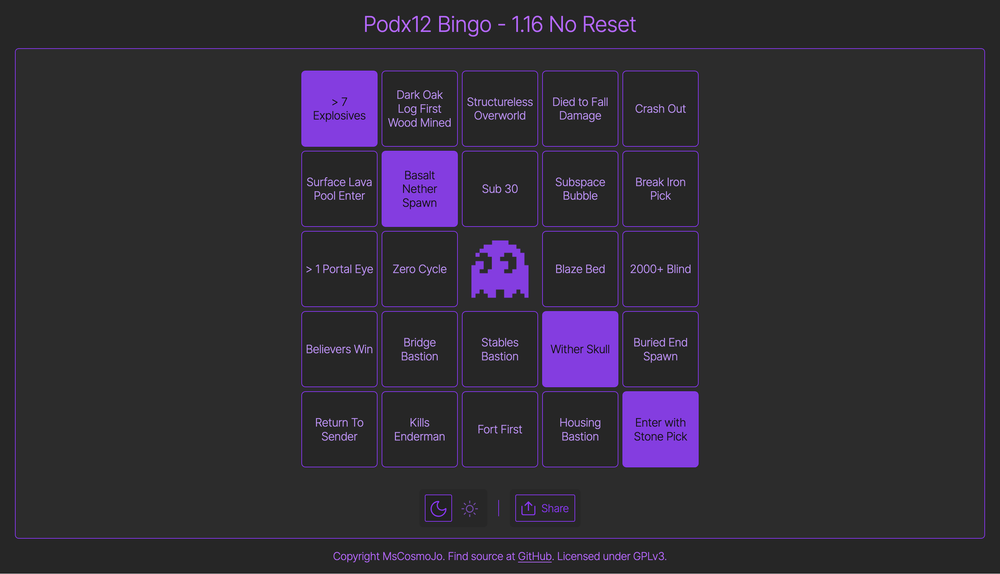

# Simple bingo card template!

Web based bingo card template, with full freedom of the board. Change the size, the freespot, and what appears on the board! Light and dark mode is available, with support for mobile and desktop. See [images](./images/examples), or the bottom of the readme, to see example images!

## Config

- boardSize int N = NxN spaces
- freespot bool = include free spot in middle or not (only available if N is odd)
- items, singles_can = array of subarrays, only one item in each subarray will potentially appear
- items, singles_must = array of subarrays, one item in each subarray must appear
- items, any = array of items, any of which will potentially appear

## Suggested Usage

- Change title, metadata, header in [index.html](./index.html)
- Change [config.json](./config.json) for your needs
- (Optionally) change free space logos and replace the [marked.png](images/marked.png) and [unmarked.png](images/unmarked.png)
- (Optionally) change color themes as you please, all used colors are defined at the top of the css style sheet for light and dark mode

## Additional Notes

Files in [root folder](./), [./css](./css), and [./js](./js) are minified. Unminified versions are available in the [assets](./assets/) folder, and you can replace the files in the root folder with those if you wish to.

## Example Images

  
   

## License

Licensed under GPLv3.0. See [LICENSE](./LICENSE) for details.
